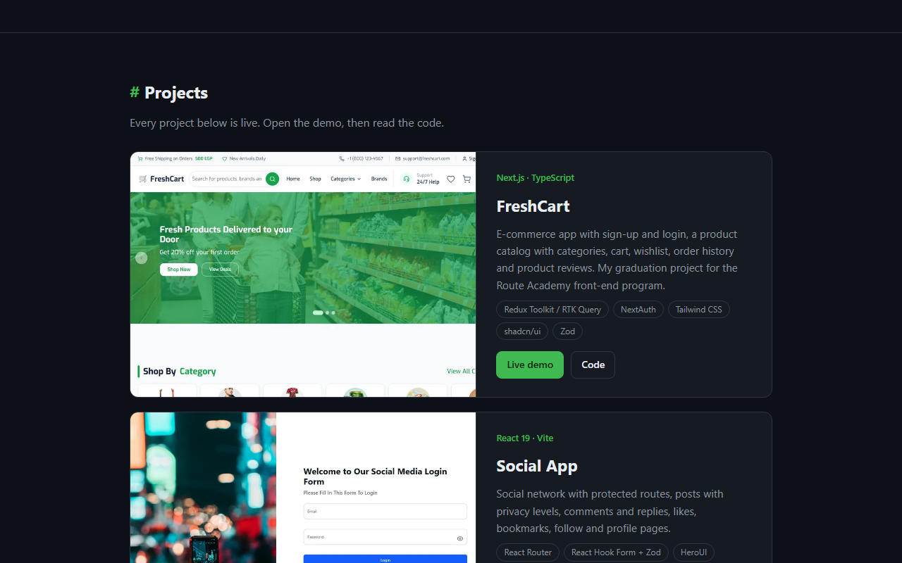

# Personal Portfolio

**A lightweight, responsive developer portfolio showcasing front-end projects, core skills, and contact links.**

**[Live Demo](https://shalabycode.dev/)** · **[Source](https://github.com/Shalabyelectronics/Shalabyelectronics.github.io)**



## About

This repository contains the source code for Mohamed Shalaby's personal developer website, hosted on GitHub Pages with a custom domain (`shalabycode.dev`). Designed as a single-page portfolio, it introduces Mohamed as a self-taught front-end developer and gives an accessible overview of the technical stack. It serves as a central hub for recruiters, hiring managers, and collaborators to review the projects and get in touch.

## Features

- **Developer dark theme**: Styled with dark GitHub-inspired colors using native CSS custom properties.
- **Featured projects**: FreshCart and Social App get wide cards with the screenshot beside the description; they stack on small screens.
- **Responsive project grid**: Four more projects in a two-column grid (one column under 680px), each with a screenshot, stack tags, and Live demo + Code buttons.
- **More projects list**: Compact rows for smaller work, with an "In progress" label where a project isn't finished.
- **Optimized screenshots**: 960×600 WebP thumbnails (about 190 KB for all six) with explicit sizes and lazy loading.
- **Social previews**: Open Graph and Twitter Card tags with a 1200×630 preview image, plus an SVG favicon.
- **Skills section**: Current front-end technologies as chips (JavaScript, TypeScript, React, Next.js, Redux Toolkit, Tailwind CSS, React Hook Form + Zod, and more).
- **Contact hub**: Provides direct links to GitHub, LinkedIn, YouTube, and an email contact button.
- **Native smooth scrolling**: Navigates directly from hero action buttons to the projects section.

## Built With

- HTML5 (Semantic elements)
- CSS3 (Flexbox, CSS Grid, Custom Properties, Media Queries)
- GitHub Pages & CNAME (Static hosting and custom domain management)

## What I Learned

- Designing consistent color palettes and modular themes using CSS variables in `:root`.
- Building responsive multi-column layouts with CSS Grid and media queries without external UI frameworks.
- Structuring semantic, accessible HTML with proper metadata, smooth scrolling, and secure outbound links (`rel="noopener"`).
- Deploying a custom apex domain to GitHub Pages using a repository `CNAME` record.

## Getting Started

To run this site locally, no build step or package manager is required:

1. Clone the repository:
   ```bash
   git clone https://github.com/Shalabyelectronics/Shalabyelectronics.github.io.git
   ```
2. Navigate to the project directory:
   ```bash
   cd Shalabyelectronics.github.io
   ```
3. Open `index.html` in your web browser, or launch it with the VS Code **Live Server** extension.

## Project Structure

```text
Shalabyelectronics.github.io/
├── CNAME          # Custom domain configuration for GitHub Pages
├── favicon.svg    # Site icon
├── img/           # Project screenshots (WebP) and og.png social preview
├── docs/          # README screenshot
└── index.html     # Single-page markup, content, and inline stylesheet
```

## Roadmap

- [ ] Extract inline styles into a separate, modular CSS stylesheet.
- [x] Add screenshots and live demo links to every project card.
- [ ] Add a downloadable CV.
- [ ] Implement a light and dark mode toggle using JavaScript and `localStorage`.
- [ ] Add dynamic project filtering by technology tag.

## Author

**Mohamed Shalaby**
- Website: [shalabycode.dev](https://shalabycode.dev)
- GitHub: [@Shalabyelectronics](https://github.com/Shalabyelectronics)
- LinkedIn: [in/mhdshalaby](https://www.linkedin.com/in/mhdshalaby/)
